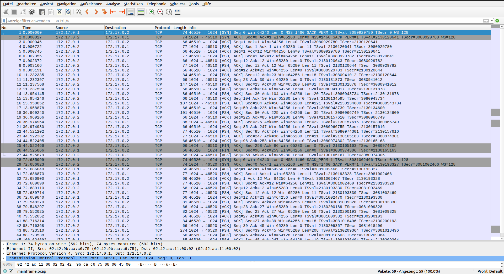
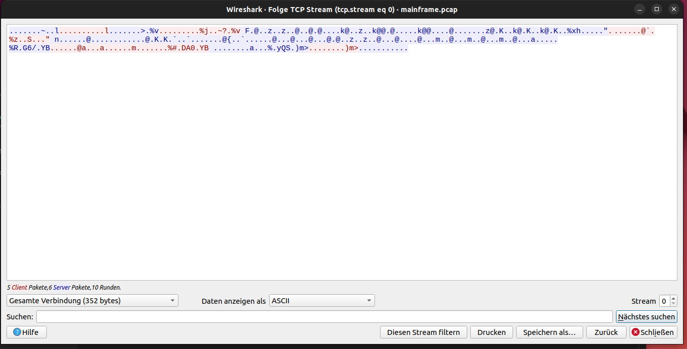
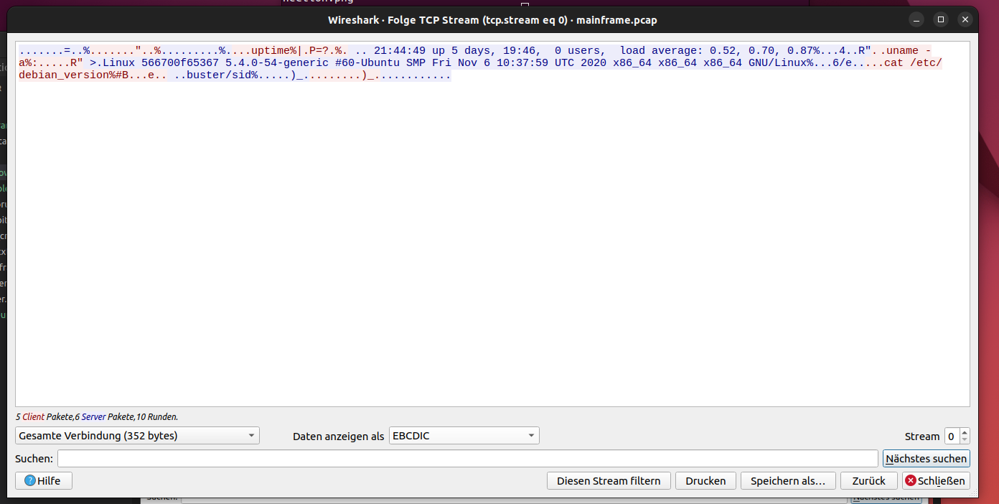

# Writeup for Mainframe

| Category        | Author         | Points   | Solves (junior) | Difficulty rating |
| -------------   | -------------  | ------   | ------          |  ----- |
| networking          | c3c           | ?      | 26ish(?)               | Easy |


## Preface

In this networking challenge, we reverse an unknown network protocol used for remote access, employing an old IBM Mainframe encoding. We receive a .pcap file while the description reads `It's 1995 again and you're debugging the communication with our mainframe. It's even making use of some old-time mainframe encoding. Can you hack the gibson`

## Looking at the pcap



We can see that there are two distinct tcp connections from 127.0.0.1 to 127.0.0.2 by
looking at the connecting bar at the left side, under the `No.` column. The first and
last packet of a tcp connection are connected. Lets look at the first connection, since
I only used this one to solve the challenge.



Mh. Looks like some encoding. Recall the challenge description? Maybe thats because of some mainframe
encoding? After a bit of googling one finds https://en.wikipedia.org/wiki/EBCDIC. Lets set this as a
decoding in the same window of wireshark:



Looks like we're dealing with some sort of remote access protocol. I wanted to analyze the packets more
deeply and thus copied each message as a hex stream and sorted for messages sent by the server and client. For the first connection I ended up with:


```python
resp = ['010000000000007e1efe6c',
        '030000000000003e9b2576',
        '20460040f2f17af4f47af4f940a49740f5408481a8a26b40f1f97af4f66b4040 \
        f040a4a28599a26b4040939681844081a585998187857a40f04 \
        bf5f26b40f04bf \
        7f06b40f04bf8f7257868caf4ebebd922',
        '206e00d38995a4a740f5f6f6f7f0f086f6f5f3f6f740f5 \
        4bf44bf060f5f46087 \
        859585998983407bf6f060e482a495a3a440e2d4d740c6998940d596a540f640f \
        1f07af3f77af5f940e4e3c340f2f0f \
        2f040a7f8f66df6f440a7f8f66df6f440a7 \
        f8f66df6f440c7d5e461d38995a4a725522e47362f855942',
        '200b0082a4aa23859961a2898425b6795153cc296d3e',
        'ff00000000000000000000']

cmd = ['020000000000007f1efe6c',
        '100700a497a3899485256abad77e3f9b2576',
        '100900a495819485406081257a19ee53ecebd922',
        '1018008381a3406185a383618485828981956da58599a28996952523c2444130855942',
        'ff000000000000cd296d3e']
```

where cmd is an array containing the messages from the client. The server sends the first message.

## Handshake

The first three messages look like a handshake, we can notice that the most significant byte in the first three messages always increases by one. Also, the last 4 bytes of message 1 and 2 (resp[0] and cmd[0]) are quite similar. Lets load them
as unsigned ints and see what happens:

```python
>>> import struct
>>> struct.unpack('I',bytes.fromhex('7e1efe6c'))
(1828593278,)
>>> struct.unpack('I',bytes.fromhex('7f1efe6c'))
(1828593279,)
>>> 
```
seems like the client responded with the server number + 1. Nice.

Now lets look at the meaning of the second server message (resp[1]). The server here
again sends 4 random looking bytes. By looking at the end of the first non handshake message
send by the client (cmd[1]), we can make out that the last 4 bytes might again be the server
supplied number +1:


```python
>>> struct.unpack('I',bytes.fromhex('3e9b2576'))
(1982176062,)
>>> struct.unpack('I',bytes.fromhex('3f9b2576'))
(1982176063,)
>>> 
```

perfect. We can now suspect that the last 4 bytes are always the seqid and counted up by one for each packet
(excluding the handshake): 

```python
>>> from struct import unpack
>>> u = lambda x : unpack('I',bytes.fromhex(x)[-4:])[0]
>>> all([(u(cmd[i])==u(resp[i])+1) for i in range(0,len(resp)-1)])
True
>>> 
```

As one can see, the client does indeed increase the number sent by the server by one for the follow up request.

## Message Type

Lets look at the first byte of the non handshake messages. It seems that it is always 0x10 unless
its the last message or a handshake. We can guess that 0xff (cmd[5]) means transmission end. To verify that the first
byte is a message type, we can send the first client message to the live server and change the first byte
to 0x69. The server then responds with `Message type not allowed`. So it seems that this assumption was correct

## Payload

We know from looking at the pcap that the message is actually EBCDIC encoded. Up until this point, we did not yet decode any bytes and worked with the raw values returned by the server. Since this is the case and the assumptions that we made were correct until now, we can conclude that only part of each network packet is encoded with EBCDIC encoding. This would also
make sense since EBCDIC maps many characters the same way ASCII does. A big difference is where printable characters are located. So it also makes sense that we could not read the command strings that were sent when looking at the traffic with
ASCII encoding.

Since EBCDIC is, like ASCII, a one to one encoding, meaning that the byte size of a message does not change
when encoding or decoding, I could easily make out where a user supplied payload starts and ends, since all
commands end with a newline.

Look at `100700a497a3899485256abad77e3f9b2576` for example. The plain command is `uptime`. But now there are two bytes after
the message id and before the encoded payload that have no meaning yet. From experience I suspected it to be the message length:

```python
>>> import ebcdic
>>> bytes.fromhex('100700a497a3899485256abad77e3f9b2576')[3:].decode('cp1141')
'uptime......'
>>> bytes.fromhex('100700a497a3899485256abad77e3f9b2576')[1:3]
b'\x07\x00'
>>> struct.unpack('H',b'\x07\x00')
(7,)
>>> 
```

We got 7, which is the length of the string. Looking at the other packets this assumption holds true.

To recapitulate, we have the following client packet structure at this point

`[1 byte msg ID][2 byte msg len][x byte encoded msg][4 byte ?][4 byte seqID]`


## CRC

When decoding every client packet like this, we see there is a 4 byte gab before the sequence ID.
When changing this value and sending a modified packet to the server we get `CRC fail`. At this
point we have to ask ourself two questions:

1. what crc32 implementation is used?
2. over what part of the packet is the crc32 applied?

For the first question I just guessed and used the one supplied by pythons `zlib` library.
For the second one, I tested some different combinations and finally noticed:

```python
>>> from zlib import crc32
>>> 
>>> msg = bytes.fromhex('1018008381a3406185a383618485828981956da58599a28996952523c2444130855942')
>>> 
>>> cmd = "cat /etc/debian_version\n"
>>> 
>>> crc1 = lambda x : struct.pack('<I',crc32(x))
>>> crc2 = lambda x : struct.pack('>I',crc32(x))
>>> print('target:',msg[-8:-4].hex())
target: 23c24441
>>> 
>>> inp = cmd.encode('cp1148')
>>> 
>>> print(crc1(inp).hex())
23c24441
>>> print(crc2(inp).hex())
4144c223
>>> 
```

We can see that the crc is build over the encoded string and packed as a little endian byte value!

Now we know all building blocks of a message and can build a custom one to execute code on the server


## Building a valid message

We first have to decide on a command that we would like to send. Lets go for `cat flag.txt`. 
We also have to successfully complete the handshake before we can send our message. When
building it we just apply what we know: choose a message type of 0x10, set the length, encode the cmd, append the crc32 over
the encoded body and respond with the correct seqID. The code to do that is here:

```python
import ebcdic
from pwn import *
from zlib import crc32	

def exploit(serverid,plain):
    plain += '\n'
    enc = plain.encode('cp1141')
    crc = struct.pack('<I',crc32(enc))
    _type = b'\x10'
    _len = struct.pack('<H',len(plain))
    
    
    con = remote(f'{serverid}-mainframe.challenge.master.cscg.live',port=31337,ssl=True)
    
    # handshake
    server_chal = con.recv(1024)

    num = struct.unpack('I',server_chal[-4:])[0]

    byte_res = b'\x02'+b'\x00'*6+struct.pack('I',num+1)
    con.send(byte_res)

    seq = struct.unpack('I',con.recv(1024)[-4:])[0]

    rseq = struct.pack('I',seq+1)

    full_packet =  _type+_len+enc+crc+rseq
    
    con.send(full_packet)

    print(con.recv(1024).decode('cp1141'))


exploit('fc0b281991732588bef82415','cat flag.txt')
```

When decoding the Server response we get `CSCG{7c2b8792f6dea3f8d642e6480acda3e2}`
