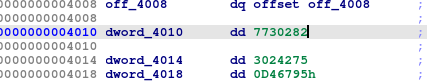

# Writeup for Hide and Seek

| Category        | Author         | Points   | Solves (junior) | Difficulty rating |
| -------------   | -------------  | ------   | ------          |  ----- |
| rev          | lion           | 258      | 18               | Easy |


## Preface

In this reversing challenge, we examine a self modifying ELF executable that hides the flag via forking and printing to dev/null. The challenge just provided a file called `hide_and_seek` while the description said `Nothing compares to a good game of hide and seek`. I used IDA on windows and WSL to solve this challenge.

## Dynamic analysis

Lets first begin by looking at what we have in front of us. Running `file hide_and_seek` gives us

```console
hide_and_seek: ELF 64-bit LSB pie executable, x86-64, version 1 (SYSV), dynamically linked, interpreter /lib64/ld-linux-x86-64.so.2, BuildID[sha1]=75be4e4fef0160aa66f45b87a408c334fdd1a305, for GNU/Linux 3.2.0, stripped
```

So we have an executable file here, lets mark it executable and run it

```console
user@lnx:~/cscg/rev/hide_and_seek$ chmod +x hide_and_seek
user@lnx:~/cscg/rev/hide_and_seek$ ./hide_and_seek 
Hello!
Here is your flag:
https://www.youtube.com/watch?v=oHg5SJYRHA0user@lnx:~/cscg/rev/hide_and_seek$
```

alright. As you can already guess, that's a link to a rickroll. Where do we go from here? I usually try
dynamic analysis first, since it is often times easier. Lets utilize `strace` to trace all system calls that the program does. This often times yields behavior that one cant observe with just running in the shell.

```console
user@lnx:~/cscg/rev/hide_and_seek$ strace ./hide_and_seek

<snip>

prlimit64(0, RLIMIT_STACK, NULL, {rlim_cur=8192*1024, rlim_max=RLIM64_INFINITY}) = 0
munmap(0x7efe2598b000, 34725)           = 0
getrandom("\x50\xf9\xe0\x36\xc3\xb5\xaa\xed\x52\x4a", 10, 0) = 10
clone(child_stack=NULL, flags=CLONE_CHILD_CLEARTID|CLONE_CHILD_SETTID|SIGCHLD, child_tidptr=0x7efe25760a10) = 153
--- SIGCHLD {si_signo=SIGCHLD, si_code=CLD_EXITED, si_pid=153, si_uid=1000, si_status=0, si_utime=0, si_stime=0} ---
clone(child_stack=NULL, flags=CLONE_CHILD_CLEARTID|CLONE_CHILD_SETTID|SIGCHLDHello!
Here is your flag:
, child_tidptr=0x7efe25760a10) = 154
https://www.youtube.com/watch?v=oHg5SJYRHA0clone(child_stack=NULL, flags=CLONE_CHILD_CLEARTID|CLONE_CHILD_SETTID|SIGCHLD, child_tidptr=0x7efe25760a10) = ? ERESTARTNOINTR (To be restarted)
--- SIGCHLD {si_signo=SIGCHLD, si_code=CLD_EXITED, si_pid=154, si_uid=1000, si_status=0, si_utime=0, si_stime=0} ---
clone(child_stack=NULL, flags=CLONE_CHILD_CLEARTID|CLONE_CHILD_SETTID|SIGCHLD, child_tidptr=0x7efe25760a10) = 155
--- SIGCHLD {si_signo=SIGCHLD, si_code=CLD_EXITED, si_pid=155, si_uid=1000, si_status=0, si_utime=0, si_stime=0} ---
clone(child_stack=NULL, flags=CLONE_CHILD_CLEARTID|CLONE_CHILD_SETTID|SIGCHLD, child_tidptr=0x7efe25760a10) = 156
clone(child_stack=NULL, flags=CLONE_CHILD_CLEARTID|CLONE_CHILD_SETTID|SIGCHLD, child_tidptr=0x7efe25760a10) = 157
clone(child_stack=NULL, flags=CLONE_CHILD_CLEARTID|CLONE_CHILD_SETTID|SIGCHLD, child_tidptr=0x7efe25760a10) = ? ERESTARTNOINTR (To be restarted)

<...>

wait4(-1, [{WIFEXITED(s) && WEXITSTATUS(s) == 0}], 0, NULL) = 153
wait4(-1, [{WIFEXITED(s) && WEXITSTATUS(s) == 0}], 0, NULL) = 154
wait4(-1, [{WIFEXITED(s) && WEXITSTATUS(s) == 0}], 0, NULL) = 155
wait4(-1, [{WIFEXITED(s) && WEXITSTATUS(s) == 0}], 0, NULL) = 156

<snap>

```

I've shortened the output, since it is quite large. You can still make out the most important discoveries from this:

1. Line 7: we see a call to `getrandom`, which fills a preallocated buffer with random bytes. In this case specifically, we have a buffer of 10 bytes. It is quite convenient that strace also shows you the function arguments

2. Line 8: We actually call clone! The clone system call on linux Systems is used to replicate the current process and continue execution at the same address. In other words: A child process is created. We also see that clone did return 153. This is the pid of the newly created child process. Actually, we can observe that `clone` is called multiple times, yielding different pids. So we actually create multiple child processes.

3. Line 23: the parent process calls `wait` here. This syscall waits for client process to finish execution. Wait actually blocks until a child process is finished and returns its pid in the end. In line 23 we can observe wait returning the pid 153, which means that the spawned child process already finished executing.

With this new information, I should have continued dynamic analysis but I did start right away with looking into the binary. Lets do it in this order as well

## Static analysis

first I loaded the ELF into ghidra and didn't quite like what I saw. So I used IDA free for the rest of the writeup.

After loading the ELF into IDA with default settings, it identifies a main function for us right away, neat.


Main is very simple so I will go over all variables here. Lets first look at the general structure of the function. We can see that after variable declaration there are two while loops, where the first depends on `v3` and the second on `_stat_loc`. After that, there is an if case comparing `v6` to some value.

Looking at the first loop, it quickly becomes apparent that `v3` is used as a counter and the loop goes to a maximum value of 9. Inside the loop we find a call to `fork`. As described, the child process will be in the (almost) exact same state as the parent. `fork` returns the pid of the child in the parent process and 0 in the child process. Now the line 14 `if  !fork()` makes sense. The program checks if `fork` returns 0, thus detecting if it is a child or a parent. If it is a child, it runs `sub_1900`. This is done 10 times.

In the second loop we can observe the program calling `wait` until wait returns a negative number, indicating an error. The error in this case wil most probably be `ECHILD`, indicating that there are no child processes to wait for.

The last if case has to do with stack protection. The compiler inserts this code to detect buffer overflows and prevent further exploitation during runtime.

Lastly I want to look at the `getrandom` call in line 11. This fills the `stat_lock` array with 10 random bytes. Generally, the decompilation is a bit weird when it comes to this array but it is not that important here. These random bytes are part of the input for the `sub_1900`. Lets call it `child_fork_func` and examine it:

Since the function is quite large, lets just look at the beginning for now:


We see a lot of variables initializations, notice that `v26` is again used for stack protection. In a scenario like this, I like to prioritize functions. One can find 3 new function names, namely `sub_13D0` in line 29 and
`sub_1480` and `sub_1390` in line 30, that are part of the an array with two elements. Lets look at them one by one:

### sub_13D0 - print_fakeflag


This function is way more simple than it looks. We begin be checking if the file descriptor, which is the only argument supplied to this function, is greater then zero. If so, we continue into a while loop. Looking carefully, we can see that we iterate over `v1`, perform some calculations based on a `v3` and add the result to `v2` for all characters of the string. After that, we compare `v2` to some fixed value and only if matches, we execute the next functionality of the code. Just thinking of the general procedure, an integrity check comes to mind. Lets rewrite this function in python:


```python
>>>check = lambda s : sum([3533 * ord(x) + 3 for x in s])
>>> print(check("Hello!\nHere is your flag:\n"))
7730282
>>> 
```

Lets examine the value `dword_4010`:



and indeed! This seems to be a simple measure to prevent people from changing strings (that can trivially be bypassed).

Looking at the rest of the function (line 24-36), we can now recognize that for the rickroll link, the same integrity check is done and in the end we just get the output that we saw during initial dynamic analysis on the specified file descriptor.


### sub_1480 - print_realflag


This function is the biggest yet. In the screenshot I've only included the most relevant lines. Before there is some variable initialization, including the same string protection on the "Hello!\\nHere is your flag:\\n" string and a call to `memset`, filling the buffer of `v13` with 10 zero bytes.

What follows is a bit more complex code. Lets examine it top down: Looking at the general structure, we can see that we deal with a restartable and breakable infinite loop. via a `goto` in line 58 and a break in line 63 There is one outer loop in line 47-68 and one inner loop in 49-59. A nice way to start is to look at the break condition of the loops. For the inner one, we compare `v10` to a static memory location, indexed by some variable `v7`, which is incremented in line 60 and runs to a maximum of 41, as seen in line 62. The goto conditions seem to be a bit harder to understand. We check if `v8` is equal to some address. If we look at the usage of `v18`, we can notice lines 45 and 46, filling `v8 = v17` with random bytes. Also, since `v8` is a pointer to random memory, it is incremented by one every iteration in line 64. This means, that we iterate over the freshly generated random bytes and restart the outer loop if we reach the end of the buffer.

In line 48 we read an integer value form the random byte buffer and do some arithmetic with the value to store it in `v10`. Remember that if `v10` is some specific value, we break the loop.

Coming back to `v13`: It is written to from the random bytes stored in `v8`. The location of the write is determined by `v9`. At the end we print `v13` in line 71.
At this point I assumed this to be the flag, given that it is memset to 0 at the top of the function and printed in the end.

With all this knowledge, I renamed the variables in the following way:


We could go into much more detail of the algorithm, but lets move on for now.

### sub_1390 - write_offset


This is a very simple one. We just take a file descriptor, seek 8416 bytes into it and then start writing `0xAC = 172` Bytes from a fixed location in the binary to it. Lets call it `write_offset`

After passing many if cases and confusing variable switching, we see another function being assigned to a variable:


### sub_17c0 - rewrite_filecontents


The function takes a file name as an argument, opens the file, goes to the beginning of it (line 17,18) and reads the whole file into the heap allocated buffer (lines 22-31). Determining the file size is accomplished via `lseek(fd,<offset>,SEEK_END)`, that sets the offset to the length of the file, thus returning it. After that, the file is closed, reopened for overwriting and the previously read buffer is once again written to the same file.

going even further down the main function, again passing by many if conditions and variable rewrites, we see `v21` getting assigned to another unknown function:


### sub_1770 - open_devnull


Again, a very simple function. First we see the already known string protection and then we open /dev/null for writing and return the file descriptor.

Now there is not much left of the `child_fork_func` function. Lets look at the end of it:


As this was my first real, non intro reversing challenge I ever played, the rather complex syntax in line 250 did not make sense to me immediately, but I could still work out what it does. First notice the keyword `__fastcall`. Maybe it is a function call? And remember `v24`? It was declared at the top of `child_fork_func` as an array holding two functions, `print_fakeflag` and `print_realflag`. `v22` seems to be the index to that array. And remember both functions took a file descriptor as an input? Looks good! In line 246 you can see `v21`, the supposed argument of the indexed function call, being assigned the return value of `open_devnull`. Another hint is that `close(v21)` is called in line 252. I was very sure that these assumptions were correct. Lets recapitulate:

## The greater picture

Okay, lets recapitulate and build a mental model of the binary: We first start by creating 10 child processes. Each child then executes the `child_fork_function` and based on its arguments, which are its id and some random bytes, it goes through many complex if statements and variable switches. In the process, it may open /dev/null, print the real flag, print a rickroll, rewrite a file to itself or overwrite a file at a specific offset. Our goal seems to be to get `v22 = 1`, to print the real flag, ideally to `v21 = stdout`.

At this point I really hoped to not be required to untangle all the if cases. Turns out, I didn't had to!

## Dynamic analysis - round 2

With all this additional knowledge, lets take another look at the behavior of the binary. This time, I really wanted to know what each child process does and after a bit of searching the internet, I found out about the beautiful `strace -ff -o`! (I would have probably been much quicker consulting the man page of strace though, tbh). With this option strace will trace every spawned child separately and even log it to a use supplied file name. So, lets go:

```console
user@lnx:~/cscg/rev/hide_and_seek$ strace -ff -s 500 -o traces/trace ./hide_and_seek 
```

I used `-s 500` to increase the length of the strings that strace shows. Now lets look at the output that we've got:


Exactly 11 traces - 10 children and one parent. perfect. At this point I would like to mention that we still don't actually know how exactly each child decides which function to run. Anyways, lets look at each function ran by example:

## print_fakeflag trace


Not much to say here. Looks just like we expected. There is also one variation where we print the fakeflag to /dev/null instead:


## rewrite_filecontents / write_offset trace


Here we can observe `rewrite_filecontents` and `write_offset` in sequence. We first open a file, rewrite its file contents and then seek to
a specific offset and write some bytes into it, after closing and opening the file again

## print_realflag trace


I've skipped over the first line of the trace showing a open to /dev/null. Interesting. We see the many calls to getrandom, so often times,
the before mentioned loop is restarted until the random bytes apply to some constraints. But in the end, we just also print a rickroll?

At this point I thought a bit about the functions I looked at and considered reversing the flag printing algorithm but luckily, I noticed something
strange:

Looking back at the trace of child that executed the `rewrite_filecontents` function, we can notice that the file we open for partial overwriting is actually
the binary itself! (line 3) Up until this point, I didn't really pay much attention to this function but it suddenly
became apperant that it had something to do with the real flag not getting printed.

To verify, lets compare the specific offset of `8416`, specified in `rewrite_filecontents`, of the used and a fresh binary
which was never run, in IDA:


Indeed! At the right is the original binary and on the left the overwritten one. But what does this overwrite actually do?
We can see that the data does not lie in the .text section, so we dont change the behavior of the binary per se. As you
can see in the screenshot, IDA tells us where this adress is used in code. Following the annotation, we land in `sub_1480` -
also known as `print_realflag`. It is used like so:


This will of course alter the behavior of the binary, since it is a crucial part of the flag decoding algorithm. Lets just
get a fresh binary from the server, utilize `strace -ff` on the first run and search for the trace of the
child executing `print_realflag`:


And we got the flag! `CSCG{w3lp_1_h0p3_y0u_d1d_n07_f4ll_f0r_7h47}` (and of course, I fell for the trick)


# Lessons learned

Dynamic analysis is really powerfull. We did not even need to understand the whole binary.
I also believe that someone with a bit more experience could have easily solved this challenge
only using strace. Personally, I have learned quite much about c functions and especially how
forking works programatically. Nice challenge.

# Mitigations

Mitigations do not apply here since this is a reversing challenge and no vulnerability was exploited.
